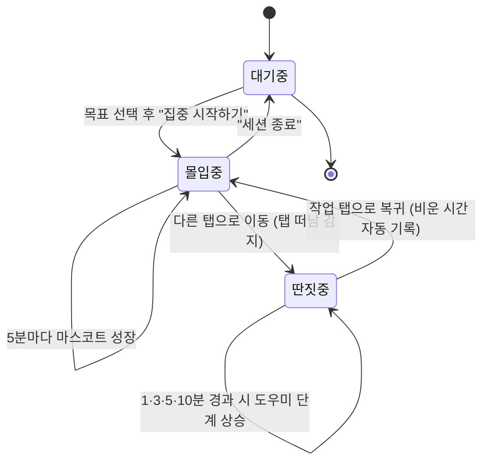

# 탭talk · 집중 집사 웹 앱

> 여러 탭(업무·쇼핑몰·유튜브)을 띄워놓고 일하다 딴짓으로 새는 순간,
> 정중한 **집사**가 *"주인님, 다시 모실까요?"* 라며 집중을 되찾아 주는 토스 스타일 웹 앱.

 

---

## 핵심 한 줄

**탭talk** = 브라우저 탭 이탈(그리고 카메라 시선 이탈)을 감지해, 잔소리 대신 정중한 집사 화법으로 집중을 되돌려 주는 집중 집사 웹 앱.

## 왜 만들었나 (문제 정의)

- 작업 탭·쇼핑몰 탭·유튜브 탭이 한 화면에 떠 있으면 **자기도 모르게** 딴짓에 빠진다.
- "지금 놀고 있다"를 **스스로 인지하기 어렵다.**
- 잔소리형 알림은 거부감이 들어 **금방 꺼버린다.**

## 어떻게 푸는가

| 접근 | 내용 |
| --- | --- |
| 탭 이탈 감지 | **Page Visibility API**로 작업 탭을 떠난 순간 즉시 포착 |
| 시선 이탈 감지(선택) | **카메라 아이컨택** — 화면을 둔 채 시선이 떠난 딴짓까지(100% 온디바이스) |
| 단계적 개입 | 딴짓이 길어질수록 도우미가 0→1→3→5→10분 단계로 등장 |
| 정중한 화법 | 잔소리가 아닌 **"주인님"** 집사 톤(4종 성격) |
| 객관적 기록 | 복귀 시 **비운 시간만큼만** 이탈로 자동 기록 (자기 신고 없음) |
| 성장 동기부여 | 집중이 이어질수록 마스코트 탭이가 **5분마다 한 뼘씩 성장** |

## 주요 기능

- 🎯 **집중 세션** 시작/종료 + 목표 시간(15·25·45·60분) 설정과 진행 링
- 🐤 **마스코트 성장 연출** — 5분마다 캐릭터가 자라고 목표 달성 시 만개
- 🍩 **딴짓 감지 & 자동 이탈 기록** — 10초 미만 잠깐 이동은 제외, 그 이상은 비운 시간만큼 객관 집계
- 🎩 **응대 스타일 4종(집사)** — 정중·다정·차분·열정, 스타일마다 캐릭터·화법 전환
- 👀 **카메라 집중 감지(opt-in)** — MediaPipe Face Landmarker 온디바이스 아이컨택
- 📺 **PiP 미니 위젯** — 작은 창으로 띄워 다른 탭에서도 상태 확인
- 📊 **오늘의 집중 요약** — 몰입·딴짓·복귀율·칭호·눈맞춤 통계
- 🤖 **AI 집중 코치** — 규칙 기반(+Copilot SDK 연동 지점) 코칭·예측
- 📱 **모바일 퍼스트 반응형** — 모바일 단일 컬럼 → 데스크탑 다단 레이아웃
- 💾 **오프라인 폴백** — 서버가 끊겨도 localStorage로 계속 동작

## 기술 스택

- **프론트엔드**: Vanilla JS + HTML + CSS, Page Visibility API, 토스 디자인 토큰, Pretendard
- **집중 감지(선택)**: 카메라 + MediaPipe Face Landmarker (온디바이스, 영상 비전송)
- **백엔드**: Node.js + Express (ESM), 파일 기반 JSON 저장
- **AI 코치**: 규칙 기반 + Copilot SDK 연동 준비(`USE_COPILOT` 플래그)

## 디렉터리 구조

```
tab-talk-web/
├── package.json        # 배포 진입점 (npm start → node server/server.js)
├── MVP.md              # 상세 MVP 정의서 (흐름·기능·로드맵)
├── public/             # 프론트엔드 (정적 호스팅)
│   ├── index.html
│   ├── app.js          # 앱 로직 (세션·감지·카메라·PiP·코치)
│   └── styles.css      # 토스 스타일 + 반응형
└── server/             # 백엔드 (Express)
    ├── server.js       # API + 정적 파일 서빙
    ├── store.js        # 파일 기반 통계 저장
    └── coach.js        # 규칙 기반 코칭·예측
```

## 로컬 실행

```bash
cd tab-talk-web
npm install            # express 설치
npm start              # http://localhost:3000
```

> 카메라 집중 감지는 기본 꺼짐(opt-in)이며, 켜더라도 영상 프레임은 서버로 전송되지 않습니다.

## API 명세

| 메서드 | 경로 | 설명 |
| --- | --- | --- |
| GET | `/api/health` | 헬스체크 |
| GET | `/api/stats/today` | 오늘 통계 조회 |
| POST | `/api/session/event` | 이벤트 기록 (start/leave/return/focus-tick/stop) |
| POST | `/api/stats/reset` | 오늘 통계 초기화 |
| GET | `/api/coach` | AI 코칭 메시지 |
| GET | `/api/history` | 최근 기록 |
| GET | `/api/forecast` | 최근 패턴 기반 이번 세션 예측 |

## 사용자 흐름



## 프라이버시

- 카메라는 **opt-in**(기본 꺼짐)이며 영상 프레임은 **절대 서버로 전송되지 않습니다** — 100% 브라우저 내 분석.
- 저장되는 것은 "응시 집중 초/이탈 횟수" 같은 **숫자 통계뿐**입니다.

## Azure 배포

`server.js`는 `process.env.PORT`를 사용하고 같은 프로세스에서 정적 파일까지 서빙하므로, **단일 App Service(Linux·Node)** 로 바로 배포할 수 있습니다.

```bash
# 0) Azure CLI 로그인
az login

# 1) tab-talk-web 폴더에서 한 번에 배포 (App Service 자동 생성)
cd tab-talk-web
az webapp up \
  --name tabtalk-<고유접미사> \
  --runtime "NODE:20-lts" \
  --sku B1 \
  --location koreacentral

# 2) 시작 명령 지정 (루트 package.json의 start 스크립트 사용)
az webapp config set \
  --name tabtalk-<고유접미사> \
  --resource-group <az webapp up이 만든 RG> \
  --startup-file "npm start"
```

배포 후 `https://tabtalk-<고유접미사>.azurewebsites.net` 에서 접속합니다.

## 더 보기

- 상세 정의서: [tab-talk-web/MVP.md](tab-talk-web/MVP.md)
