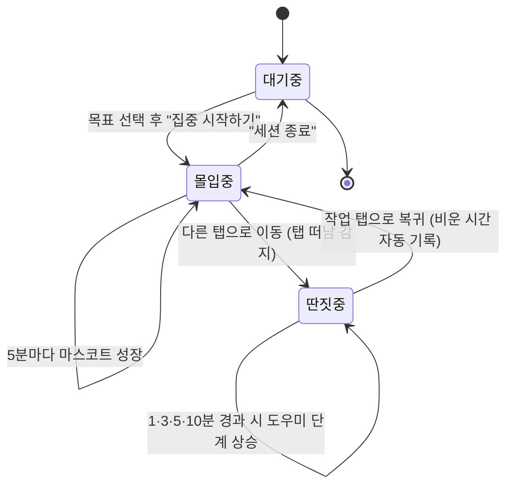

# 탭talk · MVP 정의서

> 여러 탭(업무·쇼핑몰·유튜브 등)을 띄워놓고 일하다가 딴짓으로 새면,
> 정중한 집사가 이를 감지해 "주인님, 다시 모실까요?"라며 집중을 되찾아 주는 웹 앱.

- **버전**: MVP v0.2
- **작성일**: 2026-06-20
- **상태**: 풀스택 구현 완료 (브라우저 E2E 흐름 검증됨)

---

## 1. 한 줄 정의

**탭talk** = 브라우저 탭을 떠나 딴짓하는 순간(그리고 카메라로 시선 이탈까지)을 감지해, 토스 스타일 UI로 정중하게 집중을 되찾아 주는 집중 집사 웹 앱.

## 2. 문제 정의

- 일하는 탭, 쇼핑몰 탭, 유튜브 탭이 동시에 떠 있으면 자기도 모르게 딴짓에 빠진다.
- "지금 놀고 있다"는 사실을 스스로 인지하기 어렵다.
- 잔소리형 알림은 거부감이 들어 금방 끄게 된다.

## 3. 해결 방식

- **Page Visibility API**로 작업 탭을 떠난 순간을 즉시 감지.
- (선택) **카메라 아이컨택**으로 화면을 둔 채 시선이 떠난 딴짓까지 감지(온디바이스).
- 딴짓이 길어질수록 **도우미가 단계적으로 등장**(0분→1분→3분→5분→10분).
- 잔소리가 아닌 **"주인님"** 집사 화법으로 부드럽게 복귀 유도.
- 복귀하면 **자리를 비운 시간만큼만 객관적으로 이탈에 자동 기록**(자기 신고 없이).
- 집중이 이어질수록 **마스코트 탭이가 5분마다 한 뼘씩 자라는** 성장 연출로 동기부여.

### 3.1 팝업 시간대별 집사 멘트

팝업 히어로 문구는 담당 집사와 현재 상태에 따라 아래 기준으로 노출한다. 딴짓 중에는 경과 시간에 따라 0분→1분→3분→5분→10분 단계로 상승한다.

| 집사 | 대기 중 | 몰입 중 | 딴짓 0분 | 딴짓 1분 | 딴짓 3분 | 딴짓 5분 | 딴짓 10분 | 복귀 |
| --- | --- | --- | --- | --- | --- | --- | --- | --- |
| 정중이 | 주인님, 준비되시면 집중 세션을 시작해 드리겠습니다. | 좋습니다, 주인님. 지금 흐름을 차분히 이어가겠습니다. | 주인님, 잠시 다른 곳에 머무르고 계십니다. 원하시면 바로 안내해 드리겠습니다. | 1분 정도 지나셨습니다, 주인님. 이제 집중 자리로 돌아가 보실까요? | 3분이 지났습니다. 흐름이 끊기기 전에 다시 이어가시길 권해드립니다. | 5분이 지났습니다, 주인님. 오늘 목표를 위해 지금 복귀하시면 좋겠습니다. | 10분이 지났습니다. 쉬는 시간은 충분했으니 다시 집중을 시작해 보시지요. | 돌아오셨군요, 주인님. 이어서 집중하실 수 있게 돕겠습니다. |
| 다정이 | 오셨어요? 준비되면 같이 집중을 시작해봐요. | 좋아요, 지금 잘 이어가고 있어요. 이 흐름만 지켜봐요. | 잠깐 다른 곳에 와 있어요. 괜찮아요, 천천히 돌아가면 돼요. | 1분 지났어요. 지금 돌아가면 흐름을 금방 되찾을 수 있어요. | 3분이 지났어요. 우리 다시 하던 일로 살짝 돌아가 볼까요? | 5분이 지났어요. 너무 멀어지기 전에 다시 시작해봐요. | 10분이 지났어요. 여기서 한 번만 마음을 돌려보면 좋아요. | 돌아왔네요. 좋아요, 다시 천천히 이어가봐요. |
| 차분이 | 세션을 시작하면 집중 흐름을 기록합니다. | 집중 유지 중입니다. 현재 페이스가 안정적입니다. | 집중 범위에서 벗어났습니다. 복귀하면 기록을 이어갈 수 있습니다. | 1분 경과. 지금 복귀하면 작업 맥락을 유지할 수 있습니다. | 3분 경과. 다시 작업 화면으로 돌아가 흐름을 회복해 보세요. | 5분 경과. 목표 시간이 밀리고 있어 복귀를 권장합니다. | 10분 경과. 세션을 계속할지 정하고 다시 정렬할 시점입니다. | 복귀 확인. 세션을 이어갑니다. |
| 열정이 | 좋아요, 준비되면 바로 시작해봅시다. 오늘 흐름 잡아볼게요! | 좋습니다! 지금 페이스 아주 좋아요. 그대로 밀고 갑시다! | 잠깐 방향이 새었네요. 괜찮습니다, 바로 다시 잡아봅시다! | 1분 지났습니다. 지금 돌아오면 흐름을 다시 살릴 수 있어요! | 3분 지났어요. 여기서 바로 복귀하면 아직 충분합니다! | 5분 지났습니다. 목표를 놓치기 전에 다시 달려봅시다! | 10분 지났습니다. 쉬었으니 이제 한 번 제대로 몰입해봅시다! | 좋아요, 돌아왔습니다. 다시 페이스 올려봅시다! |

## 4. 핵심 사용자 흐름 (처음 → 끝)

실제 화면 기준 상태 전이입니다.



1. **대기 중** — 첫 화면. 타이머 `00:00`, 집중 목표(15·25·45·60분) 선택, "아직 기록이 없어요. 첫 세션을 시작해볼까요?"
2. **집중 시작하기** → **몰입 중**: 🎯 타이머가 1초 단위로 올라가고, 몰입 시간이 5초마다 서버에 동기화됨. 목표 대비 진행 링이 차오르고 **5분마다 탭이가 한 뼘씩 성장**.
3. **다른 탭으로 이동** → **딴짓 중**: 🍩 타이머가 **딴짓 경과 시간**으로 전환되어 "얼마나 놀고 있는지"를 보여줌. 도우미가 단계적으로 등장(0/1/3/5/10분).
4. **작업 탭으로 복귀** → **몰입 중**: 10초 미만 잠깐 이동은 무시, 그 이상이면 **비운 시간만큼 자동으로 이탈에 기록**("자리 비움 N분 · 이탈로 자동 기록했어요"). 타이머는 몰입 시간으로 복원 — 자기 신고(업무/딴짓 선택) 단계 제거.
5. **세션 종료** → **대기 중**: "이번 세션 N분 집중하셨어요…" 요약 후 타이머 `00:00`으로 초기화 → 바로 다음 세션 시작 가능.
6. 언제든 **"코칭 받기"** 로 오늘 집중 비율 분석을, **"오늘 초기화"** 로 그날 통계 리셋 가능.

## 5. MVP 기능 범위 (In Scope)

| 기능 | 설명 | 상태 |
| --- | --- | --- |
| 집중 세션 시작/종료 | 몰입 시간 측정, 종료 시 00:00 초기화 | ✅ |
| 집중 목표 설정 | 15·25·45·60분 목표 선택, 진행 링 시각화 | ✅ |
| 딴짓 감지 | Page Visibility / blur·focus 기반 | ✅ |
| 딴짓 경과 타이머 | 딴짓 중 타이머가 경과 시간으로 전환 | ✅ |
| 자리 비움 자동 기록 | 비운 시간만큼만 객관적으로 이탈 집계(10초 미만 무시) | ✅ |
| 단계별 도우미 | 집사·놀지마AI·탭선생·딴짓경보기·집중호소인 | ✅ |
| 마스코트 성장 연출 | 5분마다 탭이가 한 뼘씩 자람, 목표 달성 시 만개 | ✅ |
| 응대 스타일 4종(집사) | 정중·다정·차분·열정 집사 — 스타일마다 캐릭터·화법 전환 | ✅ |
| 카메라 집중 감지 | 온디바이스 아이컨택(시선 이탈) 감지 — opt-in | ✅ |
| PiP 미니 위젯 | 작은 창으로 띄워 다른 탭에서도 상태 확인 | ✅ |
| 오늘의 집중 요약 | 몰입·딴짓·복귀율·칭호·눈맞춤 통계 | ✅ |
| AI 집중 코치 | 규칙 기반(+Copilot SDK 연동 지점) | ✅ |
| 모바일 퍼스트 반응형 | 모바일 단일 컬럼 → 데스크탑 다단 레이아웃 | ✅ |
| 서버 통계 저장 | 파일 기반 JSON | ✅ |
| 오프라인 폴백 | localStorage 자동 저장 | ✅ |

## 6. 범위 밖 (Out of Scope, 추후)

- 사용자 로그인/멀티 유저 (Entra ID + DB)
- 실제 Copilot SDK LLM 코칭 연동
- 주간/월간 리포트, 통계 차트
- 브라우저 확장(특정 탭별 자동 분류)
- 모바일 네이티브 앱

## 7. 기술 스택

- **프론트엔드**: Vanilla JS + HTML + CSS, Page Visibility API, Pretendard 폰트, 토스 디자인 시스템
- **집중 감지(선택)**: 카메라 + MediaPipe Face Landmarker(온디바이스, 영상 비전송)
- **백엔드**: Node.js + Express (ESM), 파일 기반 JSON 저장
- **AI 코치**: 규칙 기반 + Copilot SDK 연동 준비(`USE_COPILOT` 플래그)
- **배포(예정)**: Azure Static Web Apps(프론트) + Container Apps(API)

## 8. 아키텍처

```
브라우저(public/) ──HTTP──> Express(server/) ──> store.json (파일 저장)
        │                        │
   Page Visibility           coach.js ──(옵션)── Copilot SDK
   localStorage 폴백
```

## 9. API 명세

| 메서드 | 경로 | 설명 |
| --- | --- | --- |
| GET | `/api/health` | 헬스체크 |
| GET | `/api/stats/today` | 오늘 통계 조회 |
| POST | `/api/session/event` | 이벤트 기록 (start/leave/return/focus-tick/stop) |
| POST | `/api/stats/reset` | 오늘 통계 초기화 |
| GET | `/api/coach` | AI 코칭 메시지 |
| GET | `/api/history` | 최근 기록 |
| GET | `/api/forecast` | 최근 패턴 기반 이번 세션 예측 |

## 10. 디자인 (토스 스타일)

- 메인 컬러 토스 블루 `#3182F6`, 배경 `#F2F4F6`
- Pretendard 폰트, 큰 볼드 숫자(tabular)
- 20px 라운드 흰색 카드, **모바일 퍼스트** 반응형
  - 모바일: 단일 컬럼(히어로 → 보조 카드 세로 스택, max 480px)
  - 태블릿(≥900px): 메인 히어로 좌측 고정 + 보조 카드 우측
  - 와이드(≥1240px): 보조 카드 2열로 펼쳐 중앙 메인을 좌우에서 감싸는 배치
- 알림은 상단 토스트 + 마스코트 애니메이션
- 참고: Figma 커뮤니티 "Toss 모바일 앱 따라그리기" (무료)

## 11. 성공 지표 (MVP 검증용)

- 세션 1회당 평균 몰입 비율 ≥ 70%
- 도우미 등장 후 5분 내 복귀율 ≥ 60%
- 첫 사용 후 재방문(다음날 세션 시작) 발생

## 12. 실행 방법

```bash
cd tab-talk-web/server
npm install
PORT=3000 node server.js
# 브라우저에서 http://localhost:3000 접속
```

## 13. 다음 단계

1. 실제 Copilot SDK 연동(토큰/모델 설정)으로 LLM 코칭 활성화
2. Azure 배포 스캐폴딩(`azd`, Bicep) — Static Web Apps + Container Apps
3. Entra ID 로그인 + Cosmos DB로 멀티 유저 지원
4. 주간 리포트/차트 추가

---

## 14. 업무 vs 딴짓 자동 감지 로드맵

> 현재는 복귀 시 **자리를 비운 시간만큼만 객관적으로 이탈에 기록**한다.
> (과거에는 "업무/딴짓"을 사용자가 직접 골랐으나, 자기 신고는 부정확·귀찮아 제거했다.)
> 다음 목표는 비운 시간의 성격(업무인지 딴짓인지)까지 **앱이 스스로 판별**하는 것.

### 14.0 왜 어려운가 (기술적 전제)

- 브라우저 **보안 샌드박스** 때문에 웹페이지는 **다른 탭의 URL·내용을 읽을 수 없다.**
- 즉, 순수 웹앱만으로는 "지금 넘어간 탭이 github인지 youtube인지"를 직접 알 방법이 없다.
- 따라서 자동 감지는 **(a) 사용자 행동을 학습**하거나 **(b) 추가 권한(확장)** 을 받아야 한다.

### 14.1 1단계 — 학습형 자동 추정 (권한 불필요, 추후)

> 자기 신고를 제거한 지금은 이탈 시간을 그대로 기록한다. 추후엔 아래 신호로 성격까지 추정한다.

- **입력 신호** (웹앱이 합법적으로 아는 것)
  - 자리 비움 시간(`awayMs`) 길이
  - 시각대(오전/오후/야간), 요일
  - 직전 몰입 길이, 세션 내 이탈 빈도
  - 복귀 직후 타이핑/스크롤 재개 속도
- **모델**: 이탈 이력으로 만든 간단 통계(베이지안/로지스틱) — 개인화 임계값 학습
- **UX**: 신뢰도 높으면 자동 분류 + "되돌리기" 토스트, 애매할 때만 가볍게 확인
- **데이터**: 로컬 누적 후 서버 동기화

### 14.2 2단계 — 컴패니언 브라우저 확장 (opt-in, 진짜 감지)

웹앱 한계를 넘는 **유일한 정확한 방법**.

- Chrome/Edge **확장(MV3)** 이 `tabs` 권한으로 **활성 탭 도메인**을 읽음
- **도메인 카테고리**로 자동 분류
  - 딴짓 기본: youtube·instagram·netflix·x·reddit·쇼핑몰
  - 업무 기본: github·notion·docs·stackoverflow·figma·사내 도메인
  - 사용자가 allowlist/blocklist 직접 편집
- 확장 → 웹앱 전달: `postMessage` 또는 `chrome.runtime` → localStorage 브리지
- 프라이버시: 도메인만 전송(전체 URL·내용 X), 모든 처리 로컬 우선

### 14.3 3단계 — 고급 신호 (선택)

- **Idle Detection API**: 자리 비움(席 이탈) vs 다른 탭 작업 구분 (권한 필요, Chromium)
- **캘린더 연동**: 회의 시간대는 자동 "업무"
- **온디바이스 ML**: 신호 묶음을 가벼운 분류기로 판정, 라벨 누적 시 정확도 상승

### 14.4 단계별 적용 순서

| 단계 | 추가 권한 | 정확도 | 우선순위 |
| --- | --- | --- | --- |
| 1. 학습형 추정 | 없음 | 중 (개인화 후 상승) | ★ 먼저 |
| 2. 컴패니언 확장 | 확장 설치 | 높음 | ★★ 핵심 |
| 3. 고급 신호 | API 권한 | 상황별 | 추후 |

> **결론**: 웹앱만으로는 1단계(학습형)로 "질문을 점점 줄이고", 정확도가 필요하면 2단계(확장)로 "탭 도메인 기반 진짜 자동 분류"를 제공한다.

---

## 15. 카메라 기반 집중 감지 (아이컨택)

> 탭 전환 감지만으로는 **작업 탭을 둔 채 폰을 보거나 멀 때리는 딱짓**을 못 잡는다.
> 카메라로 "화면을 실제로 보고 있는지(아이컨택)"를 보아 이 빈틈을 메운다.

### 15.1 동작 원리

- **opt-in 토글**(기본 꺼짐) — 사용자가 직접 켜야 동작.
- `getUserMedia`로 **로컬 영상**만 사용, **온디바이스 분석**(Google MediaPipe Face Landmarker, WASM/CDN).
- 분석 신호
  - 얼굴 유무 → 자리 비움 감지
  - 머리 방향(변환 행렬 yaw/pitch) + 눈동자 시선(블렌드셰이프) → 화면 응시 vs 딸 데 보기
- **시선 이탈이 7초 이상** 지속되면 집사가 넘지: *"고객님, 화면을 보고 계신가요?"* + 마스코트 흔들림(`gaze-away`).
- 화면으로 시선 복귀 → 원래 몰입 상태로 회복.

### 15.2 프라이버시 (핵심)

- **영상 프레임은 절대 서버로 안 보냄** — 100% 브라우저 내 처리.
- 명시적 동의 토글 + 카메라 ON 표시등, 한 번에 끄기.
- 저장은 "응시 집중 초/이탈 횟수" 같은 **숫자 통계만**.

### 15.3 단계별 범위

| 단계 | 내용 | 상태 |
| --- | --- | --- |
| A (MVP) | 카메라 opt-in + 얼굴 유무 + 시선 이탈 감지 → 집사 넘지 | ✅ |
| B | 졸음(눈 감김)·자세, 시선 보정(캘리브레이션) | 추후 |
| C | 카메라+탭 신호 통합 "집중 점수" 단일화 | 추후 |

### 15.4 기술 메모

- 모델: `@mediapipe/tasks-vision` Face Landmarker(float16), CDN 동적 `import()`.
- 감지 루프는 ~8fps로 제한해 CPU 절약, `requestAnimationFrame` 기반.
- 머리 방향은 변환 행렬에서 yaw/pitch 추정, 시선은 블렌드셰이프(eyeLookIn/Out/Up/Down)로 보완 — 관대한 임계값으로 오감지 최소화.

